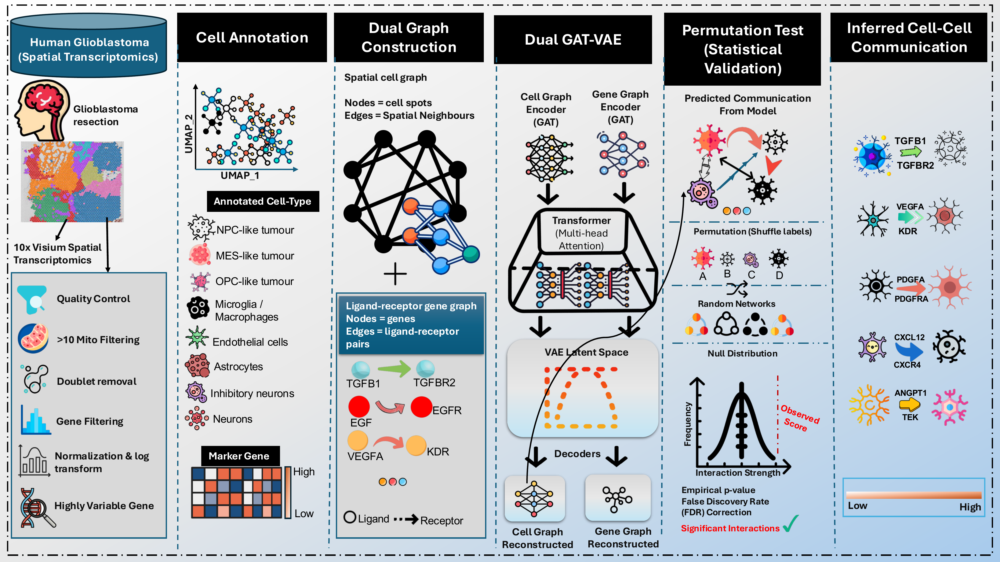

# Chicell2cell

A Graph Attention Network Variational Autoencoder (GAT-VAE) framework for spatially-aware cell-cell communication inference from spatial transcriptomics data, applied to human glioblastoma (GBM).

---

## Installation

```bash
git clone https://github.com/godwinchigozie679/chicell2cell.git
cd chicell2cell
pip install -e .
```

**Requirements:** Python ≥ 3.9, PyTorch ≥ 2.0, PyTorch Geometric ≥ 2.3, Scanpy ≥ 1.9

---

## Overview

Chicell2cell encodes a spatial cell adjacency graph and a ligand-receptor gene graph simultaneously using separate GAT-VAE encoders. A bilinear decoder predicts directed communication links between cells, and permutation-based significance testing identifies statistically significant interactions at the cell type level.

```
Spatial Cell Graph  ──►  GAT Encoder  ──►  VAE  ──►  Bilinear Decoder  ──►  Cell-Cell Communication
LR Gene Graph       ──►  GAT Encoder  ──►  VAE  ──►  Bilinear Decoder  ──►  Gene-Gene Interaction
```

---

## Package Structure

```
chicell2cell/
├── chicell2cell/
│   ├── preprocessing/       # QC, normalisation, clustering, annotation, LR filtering
│   ├── graph/               # Spatial cell graph and LR gene graph construction
│   ├── model/               # GAT-VAE layers, training, evaluation, hyperparameter tuning
│   ├── communication/       # Cluster-level CCC inference and LR interaction extraction
│   ├── visualization/       # Training plots, spatial, clustering and communication figures
│   └── comparison/          # Jaccard similarity analysis and UpSet/Venn plots
├── notebooks/               # End-to-end analysis pipeline notebook
├── DATA/                    # Processed data (adata_lr_filtered.h5ad)
├── ligand_receptor/         # CellChatDB ligand-receptor database
├── saved_model/             # Trained model checkpoint
├── database_analysis/       # Results from 7 comparison databases
└── pyproject.toml
```

---

## Usage

```bash
jupyter notebook notebooks/chicell2cell_pipeline.ipynb
```

| Section | Description |
|---------|-------------|
| 1 | Preprocessing pipeline — for demonstration only |
| 2 | Load pre-processed data — used for all downstream analysis |
| 3 | Graph construction |
| 4 | Prepare training data |
| 5 | Load trained model |
| 6 | Training plots and evaluation |
| 7 | Extract predictions and optimal threshold |
| 8 | Cluster-level communication inference |
| 9 | Significant LR interaction extraction |
| 10 | 6-panel communication patterns figure |
| 11 | Spectral clustering 7-panel figure |
| 12 | Jaccard comparison with 7 databases |
| 13 | Venn and UpSet overlap plots |

---

## Data

Raw data: human glioblastoma 10x Visium dataset (STDS0000040) from [StomicsDB](https://db.cngb.org/stomics/datasets/STDS0000040/summary).

The pre-processed LR-filtered AnnData object (`adata_lr_filtered.h5ad`) is included. The raw h5ad file (125MB) is excluded due to size constraints.

Ligand-receptor database: [CellChatDB](https://github.com/sqjin/CellChat) (Jin et al. 2021).

---

## Model Performance

| Metric | Value |
|--------|-------|
| ROC-AUC (Test) | 0.8728 |
| Average Precision (Test) | 0.8437 |
| Optimal Threshold | 0.6250 |

**Best hyperparameters:**

| Learning Rate | Latent Dim | Dropout | Hidden Dim |
|--------------|------------|---------|------------|
| 0.0005 | 16 | 0.5 | 32 |

---

## References

- Veličković et al. (2018). Graph Attention Networks. *ICLR*
- Kingma & Welling (2013). Variational Autoencoders. *arXiv:1312.6114*
- Kipf & Welling (2016). Variational Graph Auto-Encoders. *arXiv:1611.07308*
- Nickel et al. (2011). Bilinear Decoder. *ICML*
- Jin et al. (2021). CellChat. *Nature Communications*
- Wolf et al. (2018). SCANPY. *Genome Biology*

---

## Author

**Chigozie Godwin** — Masters Dissertation, C2407247

## License

To be determined — please contact the author before use.
